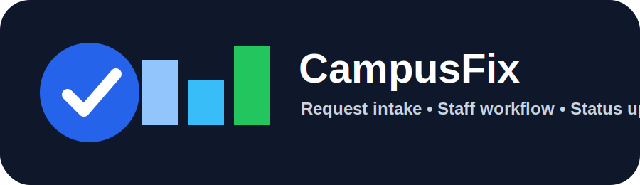
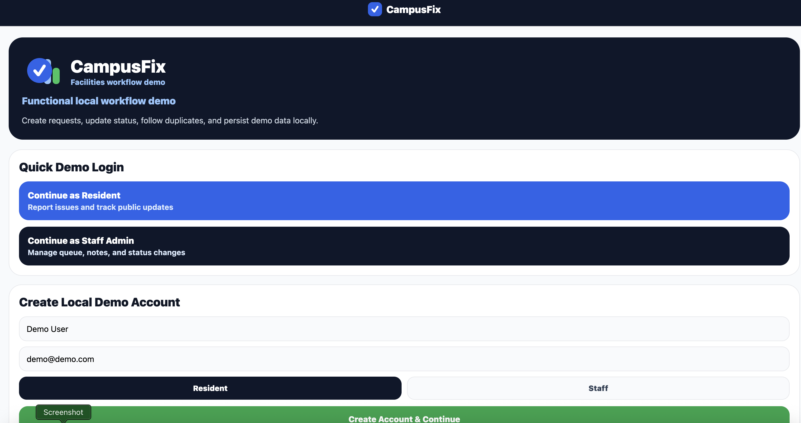
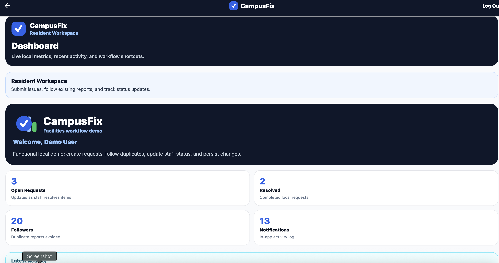
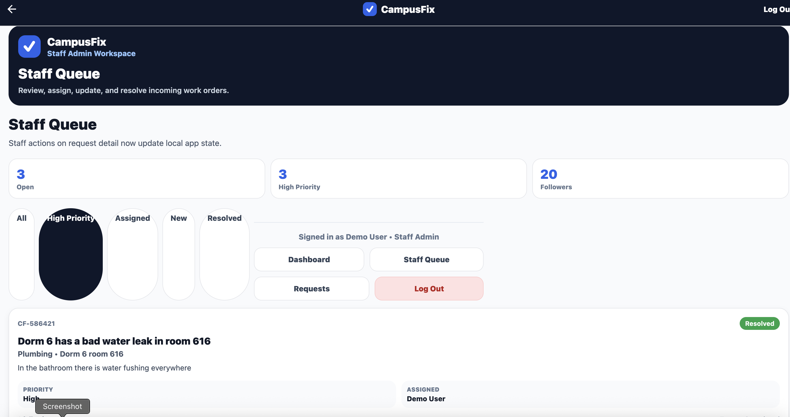

  

  <h1>CampusFix</h1>

  

    A clean-room React Native / Expo demo for two-sided facilities request management.
  

  

    
    
    
  

  

    
    
    
    
  

  

    
    
    
  

## Preview

### Login and role selection

  

### Resident workflow

  

### Staff queue and request management

  

## Overview

CampusFix is a clean-room React Native / Expo demo that models a two-sided facilities request workflow.

It is designed as a practical mobile development demo showing how a request-management app can support both public users and internal staff using a cross-platform React Native architecture.

The app intentionally uses a campus/facilities scenario so it remains independent and does not copy any company product, branding, customer implementation, or proprietary system.

## Platform support

CampusFix can run on:

- iOS through Expo Go or iOS Simulator
- Android through Expo Go or Android Emulator
- Web through Expo web preview

## Current status

CampusFix is now a functional local demo, not just static screens.

The app uses local state and AsyncStorage so demo data can be created, updated, and persisted on the device/browser without requiring a backend.

## What it does now

CampusFix currently includes:

- Demo resident login
- Demo staff/admin login
- Local demo account creation
- Header logout on logged-in screens
- CampusFix favicon/tab icon
- Footer logout on logged-in screens
- Top navigation bar for logged-in screens
- Current role indicator under navigation
- Resident vs. staff role separation
- Request creation
- Step indicator for resident request flow
- Mock photo attachment workflow
- Mock location capture workflow
- Duplicate issue detection
- Follow existing request workflow
- My Requests list that updates after submission
- Staff Queue list that updates after submission
- Request search and filtering
- Status and priority filters
- Staff assignment workflow
- Status updates
- Public updates
- Internal staff notes
- Functional public update composer
- Functional internal note composer
- Dashboard metrics
- Activity Log screen
- Recent local workflow notifications
- Local persistence with AsyncStorage

## Demo roles

### Resident

Residents can:

- Sign in using the demo resident account
- Create a local demo account
- Submit a facility issue
- Enter title, category, location, description, and priority
- Check for similar existing requests
- Follow an existing request instead of creating a duplicate
- Submit a new request
- View public request updates
- Track request status
- Navigate using the top navigation bar
- Log out from the header or footer

### Staff Admin

Staff users can:

- Sign in using the demo staff/admin account
- Create a local staff demo account
- View dashboard metrics
- Review the Staff Queue
- Filter requests
- Open request details
- Assign a request
- Mark a request in progress
- Mark a request resolved
- Post a public update visible to residents
- Add an internal staff note
- Navigate using the top navigation bar
- Log out from the header or footer

## Tech stack

- Expo
- React Native
- TypeScript
- Expo Router
- AsyncStorage
- Local mock data/state

## Example workflow

A typical demo flow:

1. Continue as Resident.
2. Submit a facility issue.
3. Run the duplicate check.
4. Submit the issue as a new request or follow an existing one.
5. Confirm the request appears in My Requests.
6. Log out.
7. Continue as Staff Admin.
8. Open Staff Queue.
9. Assign the request.
10. Mark it in progress.
11. Post a public update.
12. Add an internal staff note.
13. Mark it resolved.
14. Return to the dashboard and see updated metrics.

## Run locally

Run:

npm install

Then:

npx expo start

Then open with Expo Go, iOS Simulator, Android Emulator, or web preview.

## Architecture notes

CampusFix currently uses local state plus AsyncStorage for speed and demo portability.

The request workflow logic is separated into a service layer at:

- `src/services/requestService.ts`

That service layer handles request creation, following existing requests, staff assignment, status updates, public updates, internal notes, and request metrics.

This makes the demo easier to evolve into a backend-backed app later. The local service functions could be replaced with calls to Supabase, Firebase, or an internal REST API without rewriting the screens.

## Current limitations

This is still a demo app. It does not yet include:

- Real backend authentication
- Cloud database persistence
- Real image upload
- Device location capture
- Push notifications
- Production role permissions

Those would be the next implementation phases.

## Possible next phases

### Phase 2: Device features

- Add camera/gallery attachment with Expo ImagePicker
- Add device location capture
- Show photo preview on request detail
- Store local image URI and location data

### Phase 3: Backend

- Add Supabase, Firebase, or custom API backend
- Replace local demo accounts with real auth
- Store requests in a cloud database
- Store images in cloud storage
- Add server-side role permissions

### Phase 4: Notifications

- Add in-app notification center
- Add push notification permissions
- Notify residents when staff posts public updates
- Notify staff when new high-priority requests are created
